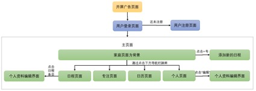
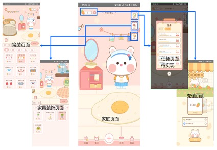
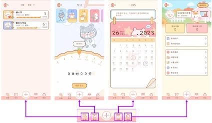
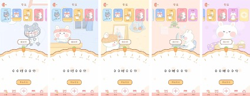

# AllTimers（Alias：Bob兔时光序）

一款模块化设计的趣味计时类APP，可以设定目标日、专注、日程的应用，包括布置家具与小兔子互动等养成类玩法～

A fun timing app that can set target days, focus, and schedule, including furniture decoration and interactive activities with little rabbits.

**注意：本开源项目仅供学习使用！内部图片UI均有版权，盗用必究。**

## 导航逻辑图

## 模块化图

## 界面展示

**主界面：养成**

**标签导航界面：计时相关**

**日程目标日设定界面：**

**日程目标日查看界面：左右滑动切换样式**

**正计时倒计时页面：点击正计时按钮切换为倒计时**

**日历页面：**

**社区页面：请进入商城，摆放“窗边”家具到主界面，点击家具即可进入**

## 技术说明

采用MVVM的模块化设计，使用LiveData、Room、Retrofit，包含大量自定义View。

（目前懒得写，后面再补充  : D）

## 免责声明
仅供学习交流使用。**使用本开源项目产生的一切后果请自行承担。**

内部图片UI均有版权，盗用必究。

## 下载
[Github Release](https://github.com/sandyz987/AllTimers/releases/latest)

## License

This project is licensed under the [GNU General Public Licence 3.0](https://choosealicense.com/licenses/gpl-3.0/).

## 赞助

维护它需要花费我的空余时间，希望你能给予一些赞助~，感激不尽 : )

